# Mora Spices and Blends

I built this project as part of my AWS and DevOps learning. 
The idea was to create a simple ecommerce website for a spices and health products business and 
then deploy it properly using Docker and Jenkins on AWS EC2.

## What the App Does

It is a shopping website where users can browse products, add them to cart, register and login. 
There is also an admin panel where the admin can add new products. 
The products are divided into three categories — Spices, Millets and Health Mixes.

## Project Structure

    Ecommerce-app.py        - Main Flask application
    templates/index.html    - Home page with product listing
    templates/login.html    - Login page
    templates/register.html - Register page
    templates/cart.html     - Cart page
    templates/admin.html    - Admin panel
    Dockerfile              - Docker container configuration
    Jenkinsfile             - Jenkins CI/CD pipeline

## Technologies Used

- Python Flask for the backend
- HTML and CSS for the frontend
- AWS EC2 for cloud deployment
- Docker for containerization
- Jenkins for CI/CD pipeline
- GitHub for version control

## Application Screenshots

### Register Page
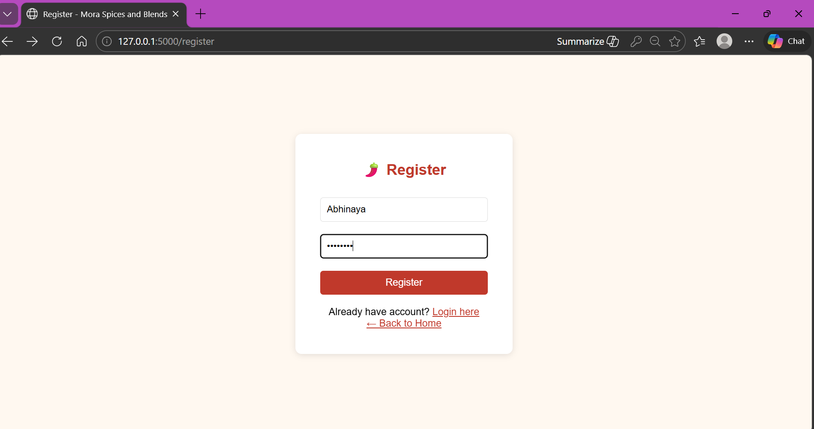

### Login Page
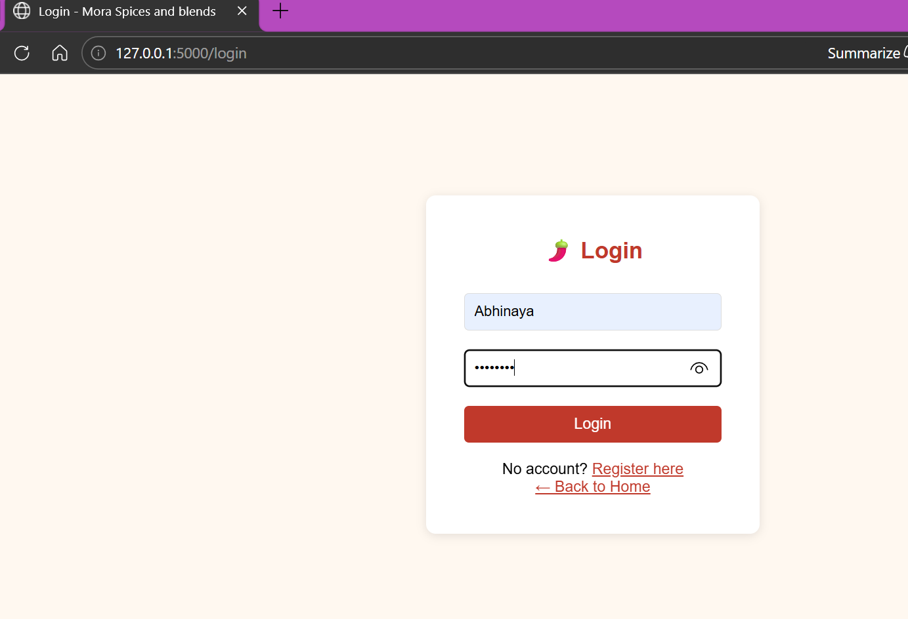

### Home Page
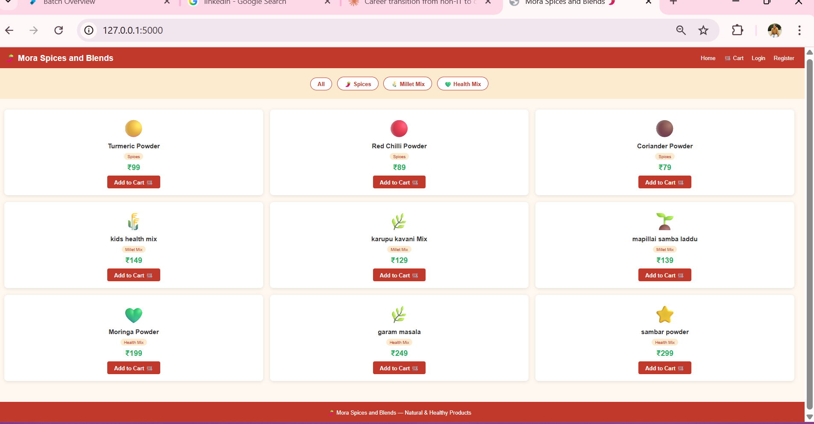

### Filtering Products by Category
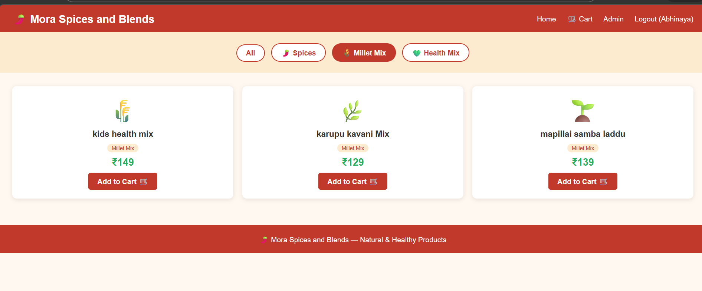

### Cart Page
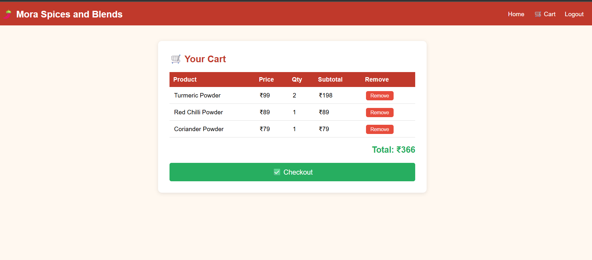

### Admin Login
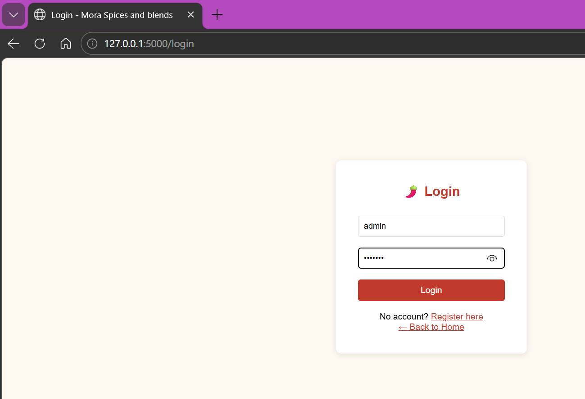

### Admin Panel
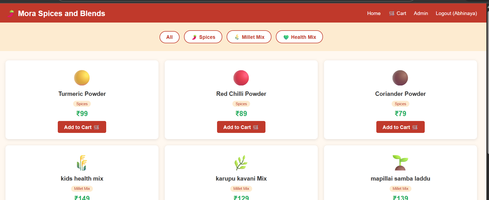

### Adding New Product
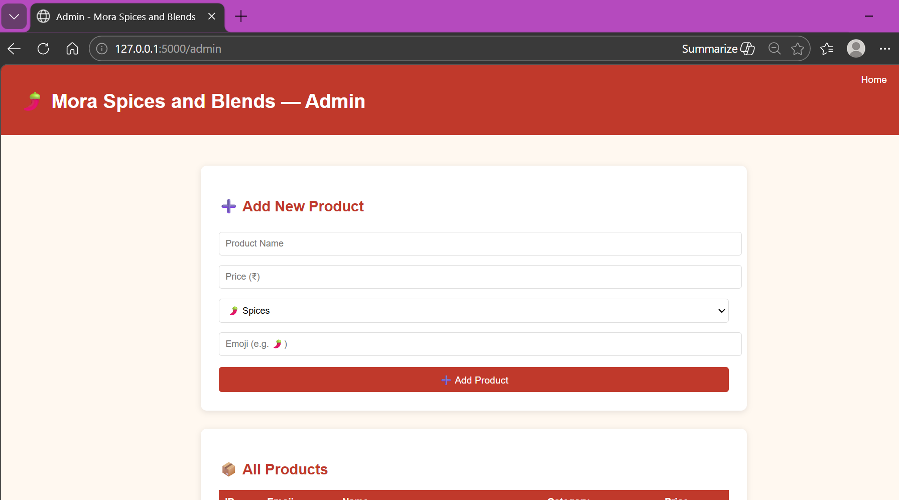

## CI/CD Pipeline Screenshots

### Flask App Running on EC2
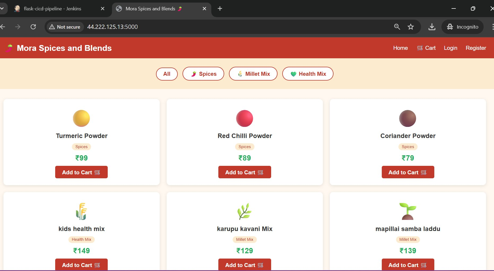

### Jenkins Pipeline - All Stages Passed
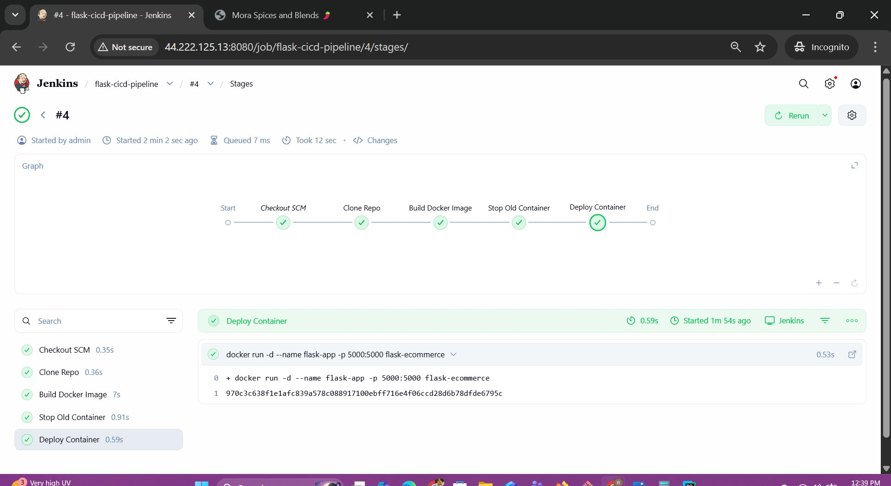

### Jenkins Build Status
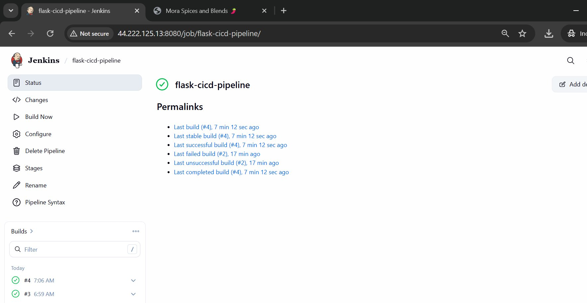

### Docker Container Running
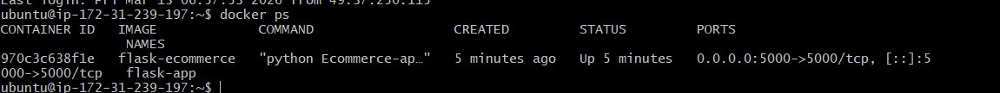

## How the CI/CD Pipeline Works

Whenever I push new code to GitHub, Jenkins automatically pulls the latest code, 
builds a new Docker image and deploys the container on EC2. The pipeline has four stages — clone the repo,
build Docker image, stop the old container and run the new one.

## How to Run Locally

Install Flask

    pip install flask

Run the app

    python Ecommerce-app.py

Open browser and go to http://127.0.0.1:5000

## Admin Access

Username - admin  
Password - admin123

## Developer

Abhinaya  
AWS Cloud and DevOps Certified
